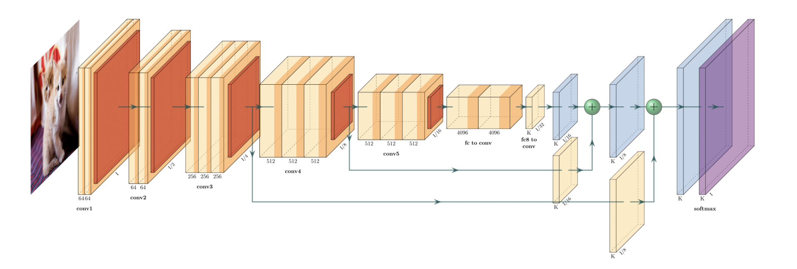

# Artificial Intelligence & Research Papers
Here you will find a collection of research papers which I have studied. I go through each paper to produce a report explaining the mathematical ideas and the tricks to coding them efficiently. Additionally, I run experiments on the code.

These are the papers which have interested me the most and therefore my master's project & potential future study will likely be in similar fields.

